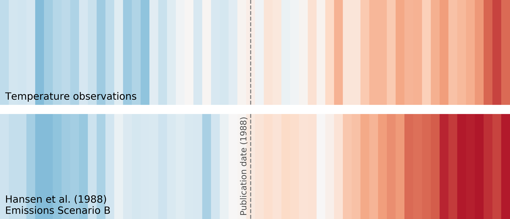

## Evaluating the performance of past climate model projections

**This repository contains the notebooks, scripts, and data that correspond to the analysis in Hausfather, Z., Drake, H. F., Abbott, T., Schmidt, G. (2019), "Evaluating the performance of past climate model projections", *Geophysical Research Letters*, https://doi.org/10.1029/2019GL085378.**

Please contact henrifdrake@gmail.com if you have any questions or difficulties with using this code.

### Attribution

This code is freely available for reuse as described in the MIT License included in this repository. However, if you use this code or any derived data products in an academic publication, you are obliged to provide the following citation:

- Hausfather, Z., Drake, H. F., Abbott, T., Schmidt, G. (2019). Evaluating the performance of past climate model projections, *Geophysical Research Letters*, doi:10.1029/2019GL085378.

If you use any of our raw or derived data from this repository, we ask that you also provide direct citations to the original papers documentating the individual climate models (or climate model ensembles) and observational data products.

### Description

The `environment.yml` file contains the python dependencies necessary to run the data processing notebooks. Figures 1, 2, S1, S2, S3, S4, and S5 were produced offline using the plotting software *STATA* based on the raw data in `data/raw` and the interim data files in `data/processed`, which are produced by the notebook `notebooks/Obs forcing analysis.ipynb` from the data files in `data/raw`. Figures 3 and S6 were produced using the python notebooks `notebooks/plot_temperature_forcing_spaghetti.ipynb` and `notebooks/plot_temperature_forcing_FAR_spaghetti.ipynb` based on the data in `data/processed/`.

----------

Copyright (c) 2019 Zeke Hausfather and Henri Drake
